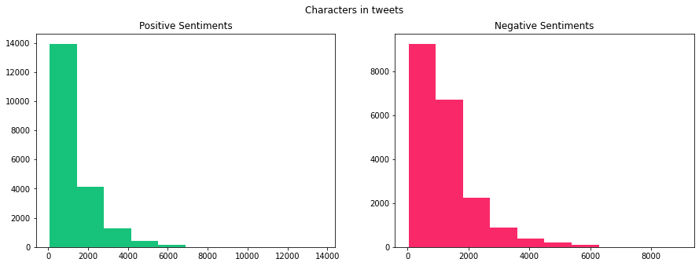
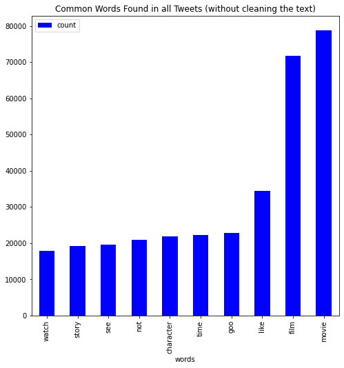

# Sentiment Analysis on Movie Reviews

Objective of this project is to create an binary classification model that can predict Movie Reviews that belong to one of the two classes: positive, negative with a reasonably high accuracy using Machine Learning algorithms and Deep learning model models.

# Description
The project utilizes a dataset of Movie Reviews which can be found at Kaggle [here](https://www.kaggle.com/competitions/shai-training-2022-a-level-2/data).
The dataset contains a total of 40000 Sentiment with a significant class balance.
- 19908 'positive' reviews
- 19815 'negative' reviews

# Explore Data Analysis
 
                  
                  
# Steps of Pre-processing
- removing stopwords & punctuation
- removing emoji & emoticons
- removing mintions
- removing html & urls
- removing digits
- removing single char & white spaces

# Models for Texts Classification
- Naive bayes

- SGD

- Random Forest Classifier

- 

